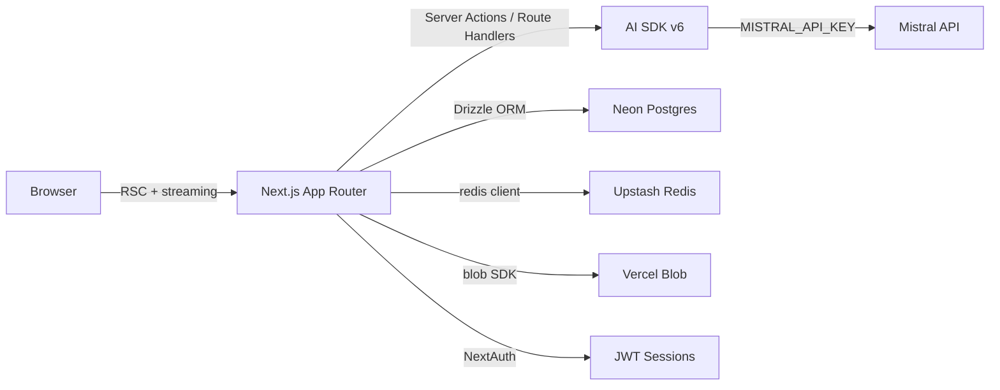

# Architecture

## Stack

- **Next.js 16 (App Router)** + **React 19** + **TypeScript** — full-stack framework, RSC + Server Actions for data fetching
- **AI SDK v6** (`ai`) — unified streaming and tool-call interface across LLM providers
- **@ai-sdk/mistral** — direct Mistral API integration (replaces Vercel AI Gateway locally)
- **Drizzle ORM** + **Neon Postgres** — type-safe SQL, schema at `lib/db/schema.ts`
- **Redis (Upstash)** — rate limiting (`lib/ratelimit.ts`)
- **NextAuth v5** — credentials + guest auth, JWT sessions
- **Vercel Blob** — file uploads
- **Tailwind CSS v4** + **shadcn/ui** — utility-first styling, component primitives
- **Biome** (`ultracite`) — linting and formatting
- **Playwright** — e2e tests

## Structure

- `app/` — Next.js routes split into `(auth)` and `(chat)` route groups
- `lib/` — shared logic: `ai/`, `db/`, `artifacts/`, `editor/`, `ratelimit.ts`
- `components/` — React components: `ui/` (shadcn primitives), `chat/`, `ai-elements/`
- `tests/` — Playwright e2e tests

## How it fits together

## Key decisions

- **Vercel AI Gateway replaced by direct Mistral SDK** — gateway requires CB activation; `MISTRAL_API_KEY` is used locally, gateway remains available as fallback
- **RSC + Server Actions** over a REST backend — data mutations go through `app/(chat)/actions.ts` and `app/(auth)/actions.ts`
- **Drizzle over Prisma** — lighter weight, closer to SQL, schema-first approach
- **Route groups** `(auth)` / `(chat)` — separate layouts without affecting URL structure

## Gotchas

- `VERCEL_OIDC_TOKEN` in `.env.local` is for the AI Gateway; it is unused locally since we use `MISTRAL_API_KEY`
- `Message_v2` and `Vote_v2` are versioned table names — schema was migrated, old tables may still exist in Neon
- `pnpm build` runs `db:migrate` first — never run build without a valid `POSTGRES_URL`
