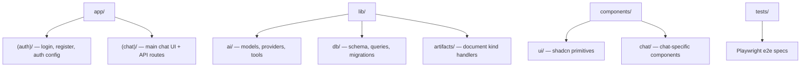

# Codebase Map

## Areas

- `app/(auth)/`: login, register pages, NextAuth handlers, auth actions
- `app/(chat)/`: main chat page, API route handlers under `api/` (chat, document, files, history, messages, models, suggestions, vote)
- `lib/ai/`: model list (`models.ts`), provider resolution (`providers.ts`), AI tools
- `lib/db/`: Drizzle schema (`schema.ts`), typed queries (`queries.ts`), migrations runner
- `lib/artifacts/`: handlers for each document kind (text, code, image, sheet)
- `components/ui/`: shadcn/ui base components
- `components/chat/`: chat bubbles, input, model selector, sidebar
- `tests/`: Playwright e2e tests (auth flows, chat flows)
- `aidd_docs/`: AI context and memory bank (this folder)

## Entry points

- `app/layout.tsx` — root layout (theme, analytics, OpenTelemetry)
- `app/(chat)/page.tsx` — default route, renders the chat interface
- `lib/db/migrate.ts` — run by `pnpm db:migrate` and `pnpm build`
