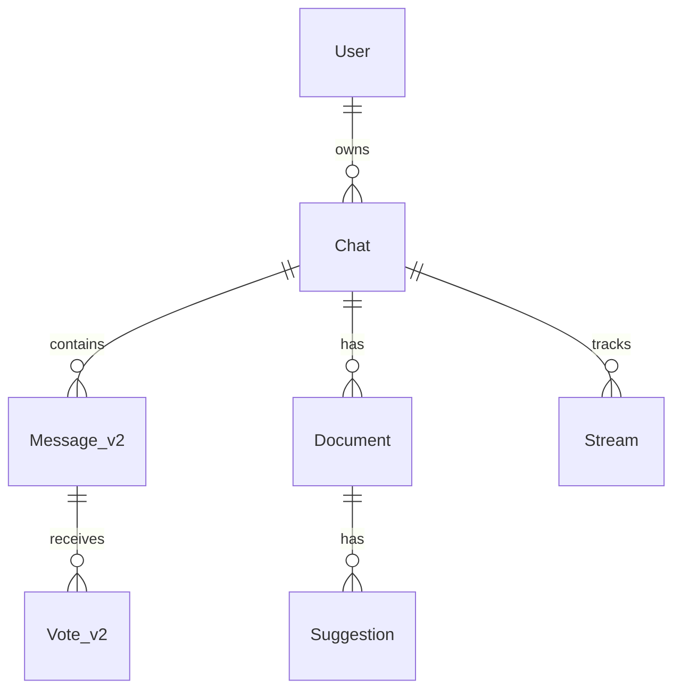

# Database

## Setup

- **Drizzle ORM** + **PostgreSQL** (Neon Serverless, Frankfurt `fra1`)
- Schema: `lib/db/schema.ts`
- Queries: `lib/db/queries.ts`
- Migrations: `lib/db/migrations/`, run via `pnpm db:migrate`

## Main entities

## Conventions

- Table names are PascalCase (`User`, `Chat`, `Message_v2`)
- Versioned table names (`_v2`) indicate a schema migration with a new shape
- UUIDs as primary keys throughout
- Drizzle `generate` → `migrate` flow; never edit migration files by hand
- `pnpm db:studio` opens Drizzle Studio for inspection
