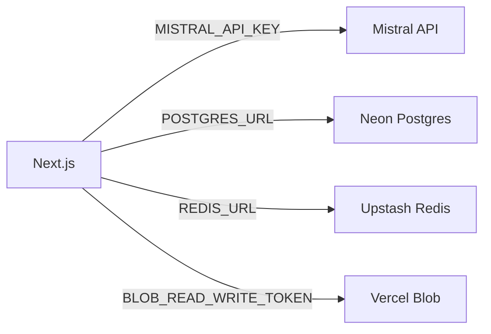

# Integration

## Internal

- UI → Server Actions / Route Handlers → Drizzle ORM → Neon Postgres
- Streaming AI response via AI SDK v6 (`streamText`) piped directly to the browser

## External services

- **Mistral API** (`MISTRAL_API_KEY`) — LLM inference, default model `mistral-large-latest`; Vercel AI Gateway remains available as fallback via `VERCEL_OIDC_TOKEN`
- **Neon Postgres** (`POSTGRES_URL`) — primary data store (Frankfurt `fra1`)
- **Upstash Redis** (`REDIS_URL`) — rate limiting per user/IP (`lib/ratelimit.ts`)
- **Vercel Blob** (`BLOB_READ_WRITE_TOKEN`) — file upload storage (Paris `cdg1`)

