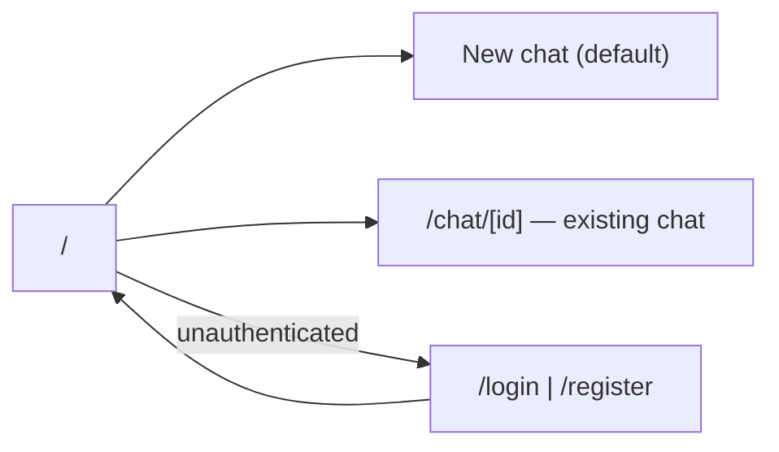

# Navigation

## Routing

- **Next.js App Router** — file-based routing, route groups do not affect URLs
- Protected routes enforced via NextAuth middleware (`middleware.ts` at project root)
- Public routes: `/login`, `/register`
- Protected routes: `/` (chat), `/chat/[id]`

## Structure

